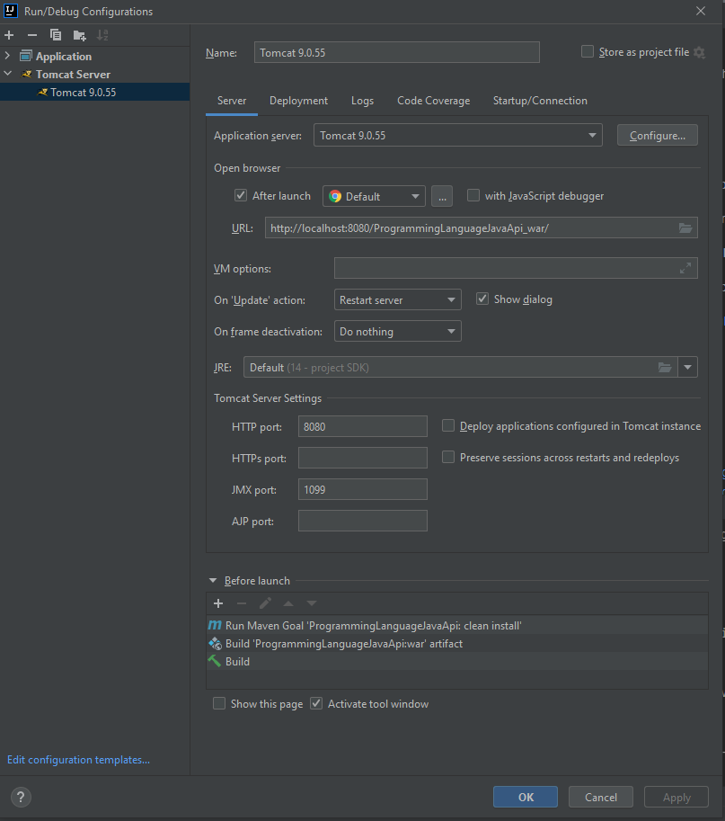

# ProgrammingLanguageJavaApi

API for the course Data Processing

Create by Thomas Koops 

## How to install

### Prerequisites
The project will require the following to run
* Maven
* A MySQL database
* Tomcat

XAMPP is recommended as it includes both phpMyAdmin and TomCat

### Configuration
Clone the project to the desired folder

Run the database.sql file in a MySQL database

Change the database config settings in Config.java to the correct username, password and database link

### Run the project
Use the Maven command "mvn clean install"

Export the generated war file inside /target/ to the webapps folder of TomCat

Head to http://localhost:8080/ProgrammingLanguageJavaApi_war/swagger-ui.html to open the swagger documentation

Alternatively, the following settings can be setup in IntelliJ



# Endpoints

The end points of the api are:
* http://localhost:8080/ProgrammingLanguageJavaApi_war/languages
* http://localhost:8080/ProgrammingLanguageJavaApi_war/issues
* http://localhost:8080/ProgrammingLanguageJavaApi_war/popularity

# Data
The data used is from the following data sets

* https://www.kaggle.com/ihelon/hello-world-in-programming-languages

Example of a language json post request:
```html
{
    "languageName": "Java",
    "fileExtension": "java",
    "helloWorldProgram": "public class Java {\r\n\tpublic static void main(String[] args) {\r\n\t\tSystem.out.println(\"Hello World\");\r\n\t}\r\n}"
}
```
Example of a language xml post request:
```html
<language>
    <languageName>Java</languageName>
    <fileExtension>java</fileExtension>
    <helloWorldProgram>public class Java {&#xd;public static void main(String[] args) {&#xd;System.out.println("Hello World");&#xd;}&#xd;}</helloWorldProgram>
</language>
```
* https://www.kaggle.com/jyotmakadiya/top-20-programming-languages-2021 

Example of a language popularity json post request:
```html
{
    "languageName": "Java",
    "year": 2022,
    "ratingPercentile": 15.0
}
```
Example of a language popularity xml post request:

```html
<languagePopularity>
    <languageName>Java</languageName>
    <year>2022</year>
    <ratingPercentile>15.0</ratingPercentile>
</languagePopularity>
```

* https://www.kaggle.com/isaacwen/github-programming-languages-data

Example of a language issue count json post request:
```html
{
    "languageName": "Java",
    "year": 2021,
    "quarter": 1,
    "issueCount": 230
}
```
Example of a language issue count xml post request:
```html
<languageIssueCount>
    <languageName>Java</languageName>
    <year>2021</year>
    <quarter>1</quarter>
    <count>230</count>
</languageIssueCount>
```

